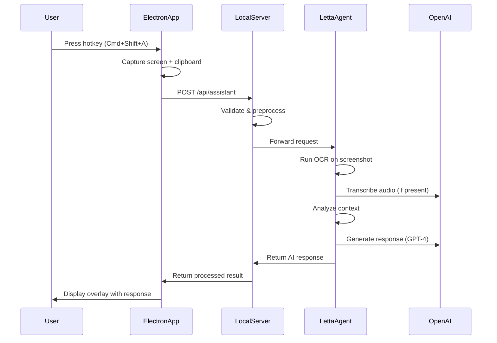
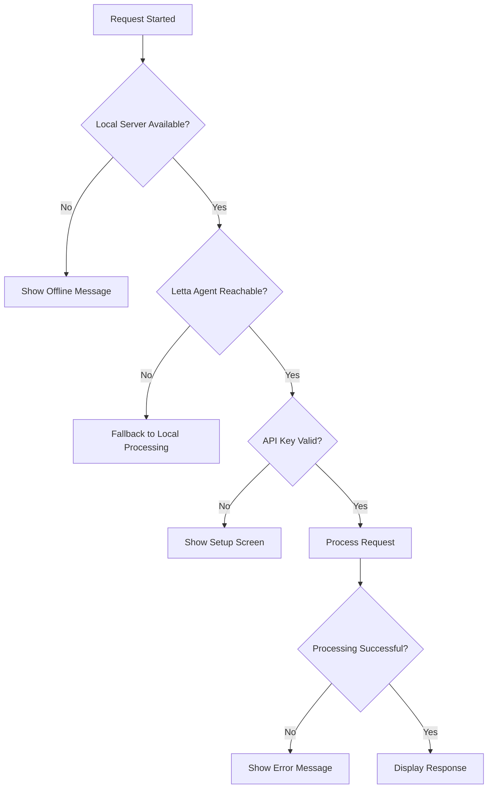

# Catfish Architecture 🏗️

This document provides a comprehensive overview of Catfish's system architecture, component interactions, and data flow.

## 🔍 System Overview

Catfish is built as a distributed system with three main components:

```
┌─────────────────┐    ┌──────────────────┐    ┌─────────────────┐
│   Desktop App   │───▶│   Local Server   │───▶│  Letta Agent    │
│   (Electron)    │    │   (Express.js)   │    │   (Cloud)       │
└─────────────────┘    └──────────────────┘    └─────────────────┘
        │                       │                       │
        ▼                       ▼                       ▼
┌─────────────────┐    ┌──────────────────┐    ┌─────────────────┐
│ • UI/UX         │    │ • Data Pipeline  │    │ • AI Processing │
│ • Screen Cap    │    │ • OCR/STT        │    │ • Context Mgmt  │
│ • User Input    │    │ • API Gateway    │    │ • Response Gen  │
│ • Settings      │    │ • WebSocket      │    │ • Memory        │
└─────────────────┘    └──────────────────┘    └─────────────────┘
```

## 🖥️ Desktop Application (Client)

### Technology Stack

- **Framework**: Electron 27+
- **UI**: React 18 + TypeScript
- **Styling**: Styled Components + Framer Motion
- **State**: React Hooks + Context API
- **Build**: Vite + TypeScript

### Key Components

#### Main Process (`client/src/main/`)

```typescript
class CatfishApp {
  private mainWindow: BrowserWindow;     // Main app window
  private overlayWindow: BrowserWindow;  // Response overlay
  
  // Core responsibilities:
  // - Window management
  // - Global shortcuts
  // - Screen capture
  // - IPC communication
  // - Secure API key storage
}
```

#### Renderer Process (`client/src/renderer/`)

```typescript
// Main UI Components
├── App.tsx              // Root application component
├── components/
│   ├── SetupScreen      // Initial configuration
│   ├── MainScreen       // Primary interface
│   ├── OverlayScreen    // AI response display
│   └── SettingsScreen   // User preferences
└── services/
    ├── api.ts           // Server communication
    ├── storage.ts       // Local data persistence
    └── analytics.ts     // Usage metrics
```

### Data Flow

1. **User Input**: Global hotkey press detected
2. **Capture**: Screenshot + clipboard + audio (optional)
3. **IPC**: Send data to main process
4. **API Call**: Forward to local server
5. **Response**: Display AI response in overlay

### Security Features

- **Context Isolation**: Renderer process isolated from Node.js
- **Preload Scripts**: Controlled IPC exposure
- **API Key Storage**: OS keychain integration
- **Permission Requests**: Explicit user consent

## 🖧 Local Server (Orchestration)

### Technology Stack

- **Framework**: Express.js + TypeScript
- **WebSocket**: ws library for real-time communication
- **Logging**: Winston
- **Security**: Helmet + CORS
- **Processing**: Sharp (images) + Tesseract.js (OCR)

### Architecture

```typescript
class CatfishServer {
  // Core services
  private app: Express;           // HTTP server
  private wss: WebSocketServer;   // WebSocket server
  
  // Processing pipeline
  private setupMiddleware();      // Security & parsing
  private setupRoutes();          // API endpoints
  private setupWebSocket();       // Real-time communication
}
```

### Key Services

#### Data Processing Pipeline

```typescript
// server/src/services/assistant.ts
export async function processAssistantRequest(data) {
  // 1. Validate input data
  const validated = validateRequestData(data);
  
  // 2. Process screenshot (if present)
  const ocrResult = await performOCR(validated.screenshot);
  
  // 3. Process audio (if present)  
  const transcription = await performSTT(validated.audio);
  
  // 4. Forward to Letta agent
  const response = await callLettaAgent({
    screenshot: validated.screenshot,
    screenText: ocrResult.text,
    transcript: transcription.text,
    clipboard: validated.clipboard
  });
  
  return response;
}
```

#### API Endpoints

```typescript
// Core endpoints
POST /api/assistant      // Main processing endpoint
GET  /health            // Health check
WS   /ws                // WebSocket connection

// Auth & configuration
POST /api/auth/verify   // API key verification
GET  /api/config        // Server configuration
```

### Local Processing Benefits

- **Privacy**: Sensitive data processed locally when possible
- **Speed**: Reduced latency for UI interactions
- **Reliability**: Works even with intermittent connectivity
- **Security**: API keys never leave local machine

## 🤖 Letta Agent (AI Processing)

### Technology Stack

- **Platform**: Letta SDK + Cloud Infrastructure
- **Language**: TypeScript/JavaScript (ESM)
- **AI Models**: OpenAI GPT-4, Whisper, Tesseract OCR
- **Memory**: Ephemeral + Persistent storage

### Agent Pipeline

```typescript
// agent/src/pipeline.ts
export const OverlayPipeline = new Pipeline({
  name: 'catfish-overlay-assistant',
  tools: [OcrTool, SttTool, LlmTool, ContextTool],
  
  async run(ctx) {
    // 1. Extract text from screenshot
    const screenText = await ctx.callTool('ocr', {
      image: ctx.input.screenshot
    });
    
    // 2. Transcribe audio (if present)
    const transcript = await ctx.callTool('stt', {
      audio: ctx.input.audio
    });
    
    // 3. Analyze context and build prompt
    const context = await ctx.callTool('context', {
      screenText: screenText.text,
      transcript: transcript.text,
      clipboard: ctx.input.clipboard
    });
    
    // 4. Generate AI response
    const response = await ctx.callTool('llm', {
      prompt: context.enhancedPrompt,
      context: context.analysis
    });
    
    return { answer: response.text };
  }
});
```

### AI Tools

#### OCR Tool (`OcrTool`)
- **Purpose**: Extract text from screenshots
- **Technology**: Tesseract.js + Sharp (preprocessing)
- **Features**: Multi-language support, confidence scoring
- **Optimization**: Image preprocessing for better accuracy

#### STT Tool (`SttTool`)
- **Purpose**: Transcribe audio to text
- **Technology**: OpenAI Whisper API
- **Features**: Language detection, speaker separation
- **Input**: Base64 encoded audio (WebM format)

#### Context Tool (`ContextTool`)
- **Purpose**: Analyze and categorize input data
- **Features**: Content type detection, prompt enhancement
- **Categories**: Code, documents, data, errors, general

#### LLM Tool (`LlmTool`)
- **Purpose**: Generate intelligent responses
- **Technology**: OpenAI GPT-4
- **Features**: Context-aware responses, conversation memory
- **Optimization**: Response length limits, temperature control

### Memory Management

```typescript
// Letta memory configuration
memory: {
  ephemeral: {
    type: 'in-memory',
    maxEntries: 10,      // Last 10 interactions
    ttl: 300000          // 5 minutes
  },
  core: {
    type: 'persistent',
    provider: 'file',    // User preferences, API keys
    encryption: true
  }
}
```

## 🔄 Data Flow Diagram

### Request Processing Flow



### Error Handling Flow



## 🔐 Security Architecture

### Data Protection

1. **Encryption at Rest**:
   - API keys stored in OS keychain
   - User preferences encrypted locally
   - No sensitive data in plain text

2. **Encryption in Transit**:
   - HTTPS for all external communications
   - TLS 1.3 for Letta agent connections
   - Certificate pinning for API endpoints

3. **Access Control**:
   - Explicit permission requests
   - Granular data capture controls
   - User-controlled data retention

### Privacy by Design

- **Minimal Data Collection**: Only capture what's necessary
- **Local Processing**: OCR and initial analysis done locally
- **User Control**: Granular privacy settings
- **Data Retention**: Configurable cleanup policies

## 📊 Performance Characteristics

### Latency Targets

| Operation | Target | Typical |
|-----------|--------|---------|
| Screen Capture | < 100ms | 50ms |
| Local OCR | < 2s | 1.2s |
| API Response | < 5s | 3s |
| Overlay Display | < 200ms | 100ms |

### Resource Usage

| Component | CPU | Memory | Disk |
|-----------|-----|--------|------|
| Electron App | 2-5% | 150MB | 200MB |
| Local Server | 1-3% | 100MB | 50MB |
| During Processing | 15-30% | 300MB | - |

### Scalability

- **Concurrent Requests**: Limited to 5 per user
- **Rate Limiting**: 60 requests per minute
- **Memory Management**: Automatic cleanup after processing
- **Connection Pooling**: Reuse HTTP connections

## 🔮 Future Architecture

### Planned Enhancements

1. **Plugin System**: Extensible tool architecture
2. **Local Models**: Offline AI processing options
3. **Multi-User**: Team collaboration features
4. **Mobile Apps**: iOS/Android companions
5. **Voice Interface**: Hands-free operation

### Migration Strategy

- **Backward Compatibility**: Version-aware API design
- **Graceful Updates**: Hot-swappable components
- **Data Migration**: Automated schema updates
- **Feature Flags**: Gradual rollout of new features

---

This architecture enables Catfish to be fast, secure, and extensible while maintaining a great user experience. The modular design allows for independent scaling and updates of each component. 